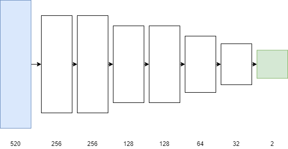
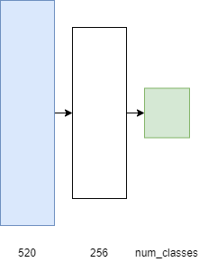

# Dataset

The data set can be found at [https://archive.ics.uci.edu/ml/datasets/ujiindoorloc](https://archive.ics.uci.edu/ml/datasets/ujiindoorloc).
It was already split into train/validation sets. The provided
validation set was used as a test set. The training dataset was split
into training and validation sets. The split was done based on USERID
column so that training set contains 70% of the data and the validation
set contains 30%. The resulting validation set was used to tune the
hyperparameters of each considered model.

# k-Nearest Neighbors

A first simple approach to estimate position from a vector of RSSI
values is to use a k-Nearest Neighbors algorithm. We can estimate floor
and building by majority vote and longitude and latitude by
interpolation.

The contribution of each neighbor can be weighted with a function of its
distance to the considered vector. This approach is similar to the WKNN
approach described in [[2]](#2).

|           | k   | Weighting function |
|:----------|:----|:-------------------|
| Building  | 5   | 1/*d*2  |
| Floor     | 5   | 1/*d*2  |
| Longitude | 3   | 1/*d*2  |
| Latitude  | 3   | 1/*d*2  |

Chosen hyperparameters values for the kNN models

# Deep learning based methods

### Longitude and latitude estimation

Longitude and latitude are jointly estimated using a multilayer
perceptron.

<figure>
<figcaption aria-hidden="true">Overview of the architecture used for longitude and latitude estimation</figcaption>
</figure>

Batch normalization was applied to each layer. White Gaussian noise was
added to inputs in order to reduce overfitting. Based on the results of
experiments done on the validation set, standard deviation of 0.1 was
chosen.

Training was done with an initial learning rate of 0.001. The "reduce on
plateau" strategy which consists in reducing the learning rate when
validation loss stops decreasing was used. The model was trained for 200
epochs.

|                        | Initial learning rate | Learning rate decay | Batch size | Input noise *σ* |
|:-----------------------|:----------------------|:--------------------|:-----------|:----------------|
| Hyperparameters values | 0.001                 | 0.1                 | 128        | 0.1             |

Chosen hyperparameters values for longitude/latitude MLP regressor

### Building and floor classification

Building and floor classification is done with a simpler architecture,
with only one hidden layer.

<figure>
<figcaption aria-hidden="true">Overview of the architecture used for building and floor estimation</figcaption>
</figure>

Training was done with an initial learning rate of 0.0001.

|                        | Initial learning rate | Learning rate decay | Batch size | Input noise *σ* |
|:-----------------------|:----------------------|:--------------------|:-----------|:----------------|
| Hyperparameters values | 0.0001                | 0.1                 | 128        | 0.1             |

Chosen hyperparameters values for building/floor MLP classifier

# Results

### Longitude and latitude estimation

To evaluate the accuracy of our models on longitude/latitude estimation
the mean position error (ME) and root-mean-square error were considered.

|      | Validation ME | Validation RMSE | Test ME  | Test RMSE |
|:-----|:--------------|:----------------|:---------|:----------|
| k-NN | **8.96**      | 15.68           | **9.26** | 16.00     |
| MLP  | 9.86          | **14.14**       | 9.74     | **13.66** |

Results for the longitude/latitude estimation task

### Building and floor estimation

|      | Validation building accuracy | Validation floor accuracy | Test building accuracy | Test floor accuracy |
|:-----|:-----------------------------|:--------------------------|:-----------------------|:--------------------|
| k-NN | 0.9732                       | 0.9072                    | 0.9953                 | 0.8920              |
| MLP  | **0.9984**                   | **0.9282**                | **0.9990**             | **0.9298**          |

Results for the building and floor estimation tasks

# References
<a id="1">[1]</a> 
Joaquín Torres-Sospedra, Raúl Montoliu, Adolfo Martínez-Usó, Tomar J. Arnau, Joan P. Avariento, Mauri Benedito-Bordonau, Joaquín Huerta
UJIIndoorLoc: A New Multi-building and Multi-floor Database for WLAN Fingerprint-based Indoor Localization Problems
In Proceedings of the Fifth International Conference on Indoor Positioning and Indoor Navigation, 2014.
https://www.researchgate.net/publication/283894296_UJIIndoorLoc_A_new_multi-building_and_multi-floor_database_for_WLAN_fingerprint-based_indoor_localization_problems

<a id="2">[2]</a> 
A. Moreira, M. J. Nicolau, F. Meneses and A. Costa
Wi-Fi fingerprinting in the real world - RTLS@UM at the EvAAL competition
In 2015 International Conference on Indoor Positioning and Indoor Navigation (IPIN)
https://www.researchgate.net/publication/308855851_Wi-Fi_fingerprinting_in_the_real_world_-_RTLSUM_at_the_EvAAL_competition
